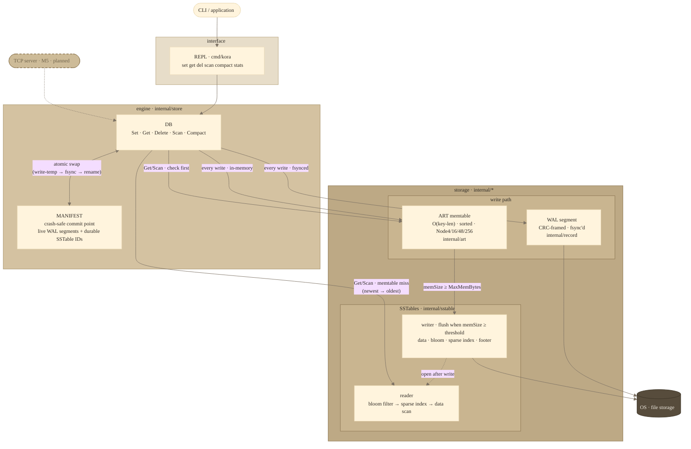

# Kora

A from-scratch database storage engine written in Go, built milestone by
milestone from a Bitcask-style log-structured KV store up through a full
LSM-tree with crash recovery and a network server.

## Status

- [x] M0 — Foundations & record format
- [x] M1 — Append-only KV store with in-memory hash index
- [x] M2 — Multiple segments + compaction
- [x] M3 — LSM-tree (ART memtable · SSTables · Bloom filters · range scans)
- [x] M4 — WAL checkpoint & crash recovery
- [ ] M5 — TCP server

> **Heads-up — active development.** The items below are known gaps that the
> next milestones will address. Anything marked M5 may change APIs or on-disk
> formats before it ships.
>
> - **No network access yet.** The only interface is the local REPL (`go run
>   ./cmd/kora`). A TCP server speaking the Postgres wire protocol is planned
>   for M5.
> - **Single-process only.** No client library, no remote connections. All
>   reads and writes go through the Go API or the REPL in the same process.
> - **No transactions or MVCC.** Every write is immediately visible to all
>   readers. Snapshot isolation and multi-statement transactions are post-M5
>   stretch goals.
> - **Segment WAL is legacy.** The M1/M2 Bitcask-style segment log is still
>   present alongside the LSM write path. A future cleanup will retire it once
>   the LSM WAL fully supersedes it.

See [MILESTONES.md](MILESTONES.md) for the full roadmap and
[DESIGN.md](DESIGN.md) for tradeoff notes.

## Getting started

```bash
go test ./...        # run the full suite
```

Try the REPL:

```bash
go run ./cmd/kora -dir ./data
> set hello world
OK
> get hello
"world"
> scan a z
"hello" -> "world"
(1 keys)
> del hello
OK
> get hello
(nil)
```

Pass `-no-sync` for faster, less durable writes. Kill the process and
re-run it against the same `-dir` — your data survives. Use `compact` to
merge segments, `compact-sst` to merge SSTables, and `stats` to watch
disk usage drop:

```bash
> stats
keys=5 segments=10 sstables=3 disk=4096 bytes
> compact
OK
> compact-sst
OK (sstables=1)
> stats
keys=5 segments=2 sstables=1 disk=512 bytes
```

## Architecture

Kora is a **log-structured merge-tree (LSM-tree)**. Writes go to a
segment WAL for durability and an in-memory sorted memtable for fast reads.
When the memtable reaches its size threshold it is flushed as an immutable
SSTable. Reads check the memtable first, then SSTables newest-to-oldest.



### SSTable on-disk format

```
[data]   key_len(4) | val_len(4) | key | value     (val_len=0xFFFFFFFF → tombstone)
[bloom]  raw bit array  (bloom_offset = index_offset − bloom_size)
[index]  key_len(4) | key | offset(8)               (one entry per 16 records)
[footer] index_offset(8) | index_count(4) | data_count(4)
       | bloom_size(4) | bloom_k(4) | magic(4="KORA")
```

The Bloom filter (10 bits/element, k=7, ~0.8% FPR) lets `Get` skip files
that definitely don't contain the key. Tombstone keys are in the filter so
a "deleted" key never falls through to an older SSTable's live value.

### Segment WAL format (M1/M2)

```
[crc32(4)] [timestamp_ms(8)] [key_len(4)] [val_len(4)] [key] [value]
```

Tombstone: `val_len = 0xFFFFFFFF`. The **MANIFEST** records the live segment
list in recency order and is the durable commit point for segment compaction.

## How it works

### Writing a key

```
db.Set([]byte("name"), []byte("kora"))
```

1. **Encode & WAL** — the key+value is serialized into a CRC-checked record
   (`crc32 | timestamp | key_len | val_len | key | value`) and appended to the
   active segment file. If `SyncOnWrite` is true, an `fsync` follows before the
   call returns — the write is on stable storage.

2. **Memtable update** — the key is inserted into the in-memory **Adaptive
   Radix Tree** (ART) with the raw value. The ART keeps all keys sorted at all
   times, so no sorting step is needed at flush time.

3. **Rollover check** — if the active segment exceeds `MaxSegmentBytes` (4 MiB
   default) it is sealed as immutable and a fresh segment opens. The MANIFEST
   is updated atomically so recovery always has a consistent segment list.

4. **Flush check** — if `memSize` exceeds `MaxMemBytes` (4 MiB default) the
   entire ART is iterated in key order and written to a new **SSTable** file,
   then prepended to the `ssReaders` list (newest first). The memtable is reset
   to empty and `memSize` to zero.

A `Delete` follows the same path but writes a tombstone record to the WAL and
inserts a zero-size `tombstone{}` sentinel into the ART.

### Reading a key

```
db.Get([]byte("name"))
```

1. **Memtable** — the ART is checked first (O(k), k = key length). A live
   value returns immediately. A `tombstone{}` value also returns immediately —
   as "not found" — without touching disk.

2. **SSTables, newest → oldest** — for each SSTable reader:
   - **Bloom filter**: if the filter says the key is *definitely absent*, the
     file is skipped entirely with no I/O.
   - **Sparse index**: binary-search the in-memory index for the last entry
     with key ≤ target, then seek to that file offset.
   - **Linear scan**: read forward at most 16 records until the key is found
     or passed. A tombstone record here means the key was deleted after this
     SSTable was written — stop searching, return "not found".

3. **Not found** — if all sources are exhausted the key doesn't exist.

### Range scan

```
db.Scan([]byte("a"), []byte("m"))
```

Under a read lock, a **k-way min-heap merge** runs over all sources at once:
the memtable ART iterator (pre-collected snapshot) and a `ScanIterator` per
SSTable (each uses the sparse index to seek near `start`). The heap pops keys
in ascending order; for duplicate keys across sources the newest source wins.
Tombstones suppress older versions and are not emitted. All results are
collected into a slice while the lock is held, then the lock is released and
an iterator over the slice is returned — safe to use while writes and
compaction run concurrently.

### Compaction

**Segment compaction** (`db.Compact`) merges all immutable segment files into
one, keeping the newest value per key and dropping tombstones. The merged file
is written to a fresh segment id; the MANIFEST is atomically replaced to name
it; old files are deleted. A crash at any point leaves a consistent state.

**SSTable compaction** (`db.CompactSSTables`) does the same for SSTable files
via a k-way merge. Because every SSTable is included in the merge, a tombstone
provably has no older live value to mask, so it is safe to drop it entirely.

### Recovery

On `Open`, Kora reads the MANIFEST to load any durable SSTables from the
previous session, then replays only the post-checkpoint WAL segments to
rebuild the ART memtable. The WAL is short — at most one segment since the
last flush — so recovery is fast regardless of total data size. Orphaned
files (written but not committed to the MANIFEST before a crash) are
detected and cleaned up automatically.

---

## Components

| Component | Package | What it does |
|---|---|---|
| REPL | `cmd/kora` | Interactive CLI; one command per line: `set`, `get`, `del`, `scan`, `compact`, `compact-sst`, `stats` |
| DB | `internal/store` | Coordinates the write path (WAL + memtable), read path (memtable → SSTables), flush, compaction, and crash recovery |
| WAL segments | `internal/store` | Append-only CRC-framed log files; every acknowledged write is fsynced before returning; replayed at startup to rebuild the memtable |
| MANIFEST | `internal/store` | Atomic (write-temp → fsync → rename) file recording the live WAL segment list and durable SSTable IDs — the crash-safe commit point for flush and compaction |
| ART memtable | `internal/art` | Adaptive Radix Tree sorted memtable; O(key-length) lookup; in-order iterator for flush and range scans; Node4 / Node16 / Node48 / Node256 |
| SSTable writer | `internal/sstable` | Writes flushed memtables as immutable sorted files: `[data][bloom][sparse index][28-byte footer]` |
| SSTable reader | `internal/sstable` | Serves point lookups (Bloom filter → sparse index → linear scan) and range iterators; loaded from MANIFEST on startup |
| Bloom filter | `internal/bloom` | Per-SSTable probabilistic filter (Kirsch-Mitzenmacher double-hashing, k=7, ~0.8% FPR); skips files on `Get` when the key is definitely absent |
| Record encoder | `internal/record` | Encodes/decodes `crc32 \| timestamp \| key_len \| val_len \| key \| value`; detects corruption; tombstones use `val_len = 0xFFFFFFFF` |
